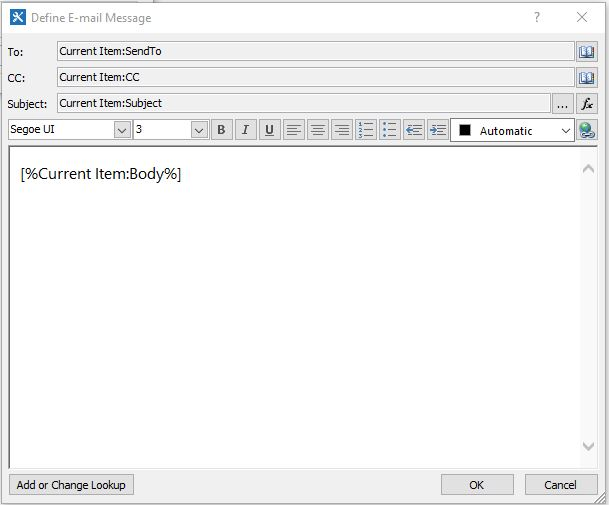

Email Notifications
===================

The Email Notifications list is a substitue to sending email notifications when the SharePoint REST API is not available or unable to send to external email addresses.

1. Open the site collection in SharePoint Designer.

2. Find the "EmailNotifications" and create a new workflow for the list. The platform type should be: "SharePoint 2010 Workflow".

3. "Step 1" should check for the SendTo field and make sure its not empty before sending the email. Below is an example of what the step will look like:

4. Define the email properties 
    - To = SendTo
    - CC = CC
    - Subject = Subject
    - Body = Body 

Below is a example:

5. Save & Publish

6. Go back to the EmailNotification list page, and click on "Start Workflow automatically when an item is created"

7. Save & Publish

The end.